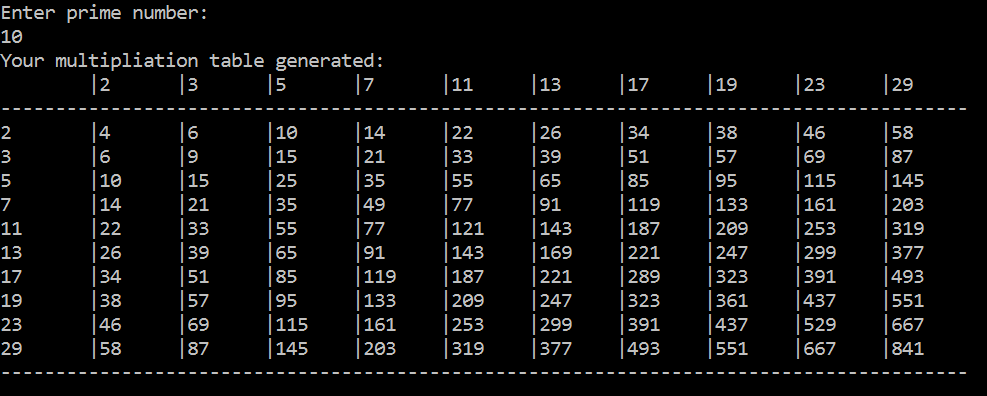
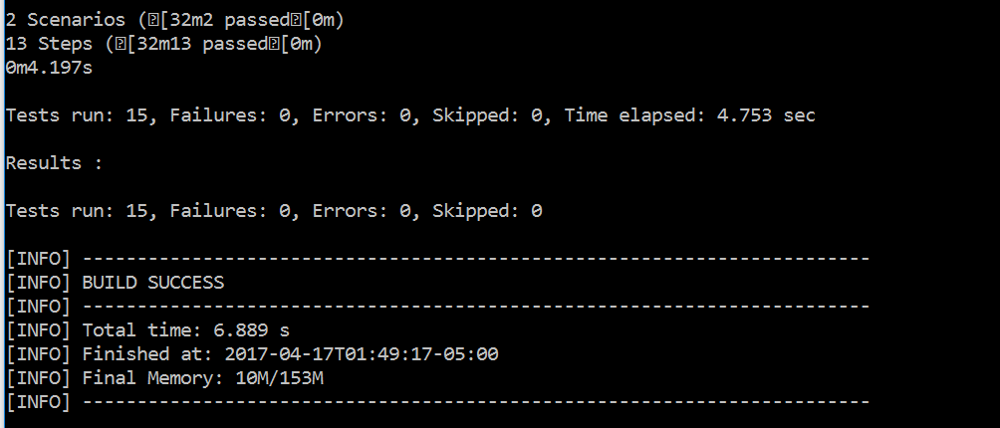

Prime Multiplication Table Tool
===============================

This tool can print the first N prime numbers efficiently

### Usage：

~~~~~~~~~~~~~~~~~~~~~~~~~~~~~~~~~~~~~~~~~~~~~~~~~~~~~~~~~~~~~~~~~~~~~~~~~~~ bash
mvn ecec:java -Pprint
~~~~~~~~~~~~~~~~~~~~~~~~~~~~~~~~~~~~~~~~~~~~~~~~~~~~~~~~~~~~~~~~~~~~~~~~~~~~~~~~

or

~~~~~~~~~~~~~~~~~~~~~~~~~~~~~~~~~~~~~~~~~~~~~~~~~~~~~~~~~~~~~~~~~~~~~~~~~~~~~~~~
mvn compile assembly:single
cd target
mvn exec:java -Dexec.mainClass=com.challenge.primes.multiplication.PrintTable
~~~~~~~~~~~~~~~~~~~~~~~~~~~~~~~~~~~~~~~~~~~~~~~~~~~~~~~~~~~~~~~~~~~~~~~~~~~~~~~~

or

~~~~~~~~~~~~~~~~~~~~~~~~~~~~~~~~~~~~~~~~~~~~~~~~~~~~~~~~~~~~~~~~~~~~~~~~~~~~~~~~
mvn compile assembly:single
cd target 
java -cp primes-multiplication-0.0.1-jar-with-dependencies.jar
~~~~~~~~~~~~~~~~~~~~~~~~~~~~~~~~~~~~~~~~~~~~~~~~~~~~~~~~~~~~~~~~~~~~~~~~~~~~~~~~

###  

### Run Example:

 

### BDD Test：

~~~~~~~~~~~~~~~~~~~~~~~~~~~~~~~~~~~~~~~~~~~~~~~~~~~~~~~~~~~~~~~~~~~~~~~~~~~~~~~~
mvn test 
~~~~~~~~~~~~~~~~~~~~~~~~~~~~~~~~~~~~~~~~~~~~~~~~~~~~~~~~~~~~~~~~~~~~~~~~~~~~~~~~

or

~~~~~~~~~~~~~~~~~~~~~~~~~~~~~~~~~~~~~~~~~~~~~~~~~~~~~~~~~~~~~~~~~~~~~~~~~~~~~~~~
mvn test
mvn compile assembly:single
cd target 
java -cp ./test-classes;primes-multiplication-0.0.1-fat-tests.jar org.junit.runner.JUnitCore com.challenge.primes.runner.RunTest
~~~~~~~~~~~~~~~~~~~~~~~~~~~~~~~~~~~~~~~~~~~~~~~~~~~~~~~~~~~~~~~~~~~~~~~~~~~~~~~~

Support features:

-   genearatePrimes.feature

-   generateProducts.feature

 

### Test Results

 

### Packages:

~~~~~~~~~~~~~~~~~~~~~~~~~~~~~~~~~~~~~~~~~~~~~~~~~~~~~~~~~~~~~~~~~~~~~~~~~~~~~~~~
    <dependency>
        <groupId>org.springframework</groupId>
        <artifactId>spring-web</artifactId>
        <version>4.3.0.RELEASE</version>
    </dependency>   
     <dependency>
         <groupId>org.springframework</groupId>
         <artifactId>spring-context</artifactId>
         <version>4.3.0.RELEASE</version>
     </dependency>
     <dependency>
         <groupId>org.springframework</groupId>
         <artifactId>spring-core</artifactId>
         <version>4.3.0.RELEASE</version>
     </dependency>
     <dependency>
         <groupId>org.springframework</groupId>
         <artifactId>spring-webmvc</artifactId>
         <version>4.3.0.RELEASE</version>
     </dependency> 
     <!-- cucumber framework --> 
     <dependency>
         <groupId>info.cukes</groupId>
         <artifactId>cucumber-java</artifactId>
         <version>1.1.8</version>
         <scope>test</scope>
     </dependency>
     <dependency>
         <groupId>info.cukes</groupId>
         <artifactId>cucumber-junit</artifactId>
         <version>1.1.8</version>
         <scope>test</scope>
     </dependency>
     <dependency>
         <groupId>junit</groupId>
         <artifactId>junit</artifactId>
         <version>4.11</version>
         <scope>test</scope>
     </dependency>
~~~~~~~~~~~~~~~~~~~~~~~~~~~~~~~~~~~~~~~~~~~~~~~~~~~~~~~~~~~~~~~~~~~~~~~~~~~~~~~~

 

### References:

>   [The n-th prime asymptotically\#page8](https://arxiv.org/pdf/1203.5413.pdf)

>   [Estimates of Some Functions Over Primes without
>   R.H.\#page](https://arxiv.org/pdf/1002.0442.pdf)7

>   [Sharper bounds for ψ, θ, π,
>   pk\#page4](http://public.gettysburg.edu/~dglass/spring04/chebyshev.pdf)

>   [STUDIES OF ENTROPY MEASURES CONCERNING THE GAPS OF PRIME NUMBERS
>   page8](https://arxiv.org/pdf/1606.08293.pdf)
